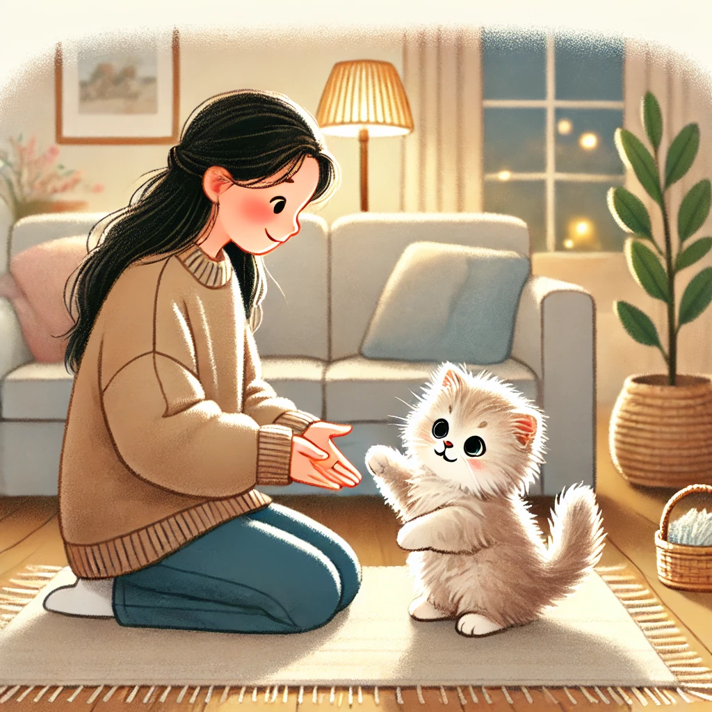

# Cat Soulmate Finder CrewAI

This project helps you find the purrfect soulmate for your cat using the power of CrewAI! 
- [Cat Soulmate Finder CrewAI](#cat-soulmate-finder-crewai)
  - [Description](#description)
  - [How to Run](#how-to-run)
  - [Project Structure](#project-structure)
    - [Agents](#agents)
    - [Tasks](#tasks)

## Description

This application utilizes CrewAI to create a team of agents that work together to find potential soulmates for your feline friend.  It leverages various tools and tasks to analyze cat profiles and identify compatible matches.

## How to Run

1.  Make sure that uv is installed https://docs.astral.sh/uv/getting-started/installation/
2.  Run the main script: `uv run python src/cat_soulmate_finder_crewai/main.py`

## Project Structure

-   `src/`: Contains the source code.
    -   `cat_soulmate_finder_crewai/`:  Python package for the cat soulmate finder.
        -   `__init__.py`: Initializes the package.
        -   `agents.py`: Defines the agents used in the CrewAI setup.
        -   `main.py`:  The main entry point to run the application.
        -   `tasks.py`: Defines the tasks performed by the agents.
        -   `tools.py`:  Contains any custom tools used by the agents.

### Agents

*   **Expert Researcher:** This agent is responsible for scouring the internet for information on cat breeds, including price ranges and traits. They conduct in-depth analyses to provide insights into the unique abilities of each breed.
*   **Senior Writer:** This agent writes well-structured reports about selected cat breeds and their suitability for different human personalities. They focus on clear and concise writing tailored to the target audience.
*   **Chief Editor:** This agent is responsible for the final report, ensuring it is free of errors, well-written, and easy to understand. They maintain high standards of quality and readability.

### Tasks

*   **Cat Internet Research Task:** This task involves researching a wide variety of cat breeds (at least 20), including lesser-known breeds, to gather information on their traits and features. This information is used to determine if a cat breed is a good fit for a human based on their lifestyle, living situation, and character.
*   **Cat Human Comparison Task:** This task focuses on identifying the best 5 cat breeds that match a given human personality and lifestyle. It uses the information gathered in the previous task to recommend compatible breeds.
*   **Generate Report Task:** This task involves generating a comprehensive report containing information about the selected cat breeds and explaining why they are a perfect fit for the user. The report includes details about each breed's size, weight, lifespan, price, and compatibility with other pets.
*   **Quality Control Task:** This task is responsible for reviewing the generated report for spelling and grammatical errors, improving the overall writing quality, and ensuring the report meets high standards.

